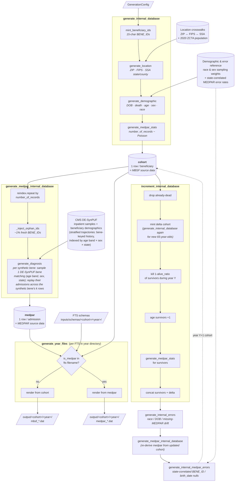

# synthetic-resdac-claims

`synthmed` — a Python package that generates **synthetic ResDAC / Medicare
claims data** (MEDPAR, MBSF) as fixed-width DAT files that conform to a
set of ResDAC File Transfer Specification (FTS) schemas.

The generator maintains a single internal cohort of synthetic beneficiaries
and rolls it forward year-by-year so that demographics, IDs, locations and
diagnosis histories stay consistent across files. Realistic data-quality
errors (race miscoding, date-of-birth drift, state-correlated null IDs)
are injected on the way through.

## Authors

- **Pavel Belakurski** — Northwestern University
  ([@ChilliPenguin](https://github.com/ChilliPenguin),
  [ORCID 0009-0006-4271-9728](https://orcid.org/0009-0006-4271-9728)) —
  original design and prototype implementation
  ([ChilliPenguin/SynthMed](https://github.com/ChilliPenguin/SynthMed)).
- **Dmitry Etin** — Deggendorf Institute of Technology
  ([ORCID 0000-0003-1068-2781](https://orcid.org/0000-0003-1068-2781)).
- **Michael Bouzinier** — Harvard University
  ([@mmcentre](https://github.com/mmcentre),
  [ORCID 0000-0002-3161-5601](https://orcid.org/0000-0002-3161-5601)) —
  packaging, refactor into a Python library, and input data provenance.

## Citation

A companion synthetic-data release is archived on Zenodo:

> Belakurski, P., Etin, D., & Bouzinier, M. (2026).
> *Synthetic Medicare-Like Inpatient Claims and Beneficiary Data
> Conforming to ResDAC FTS Layouts* (v1) [Data set]. Zenodo.
> <https://doi.org/10.5281/zenodo.18915558>

See [`CITATION.cff`](CITATION.cff) for the machine-readable citation;
GitHub renders a *Cite this repository* button in the right sidebar
from it.

## Status

Alpha — functional and exercised end-to-end at production scale:

- Migration from the original notebook is complete. All reference
  inputs live under [`inputs/`](inputs/) with per-file sidecars
  under [`docs/distributions/`](docs/distributions/) covering format,
  provenance, license, and how `synthmed` consumes them. Citations are
  consolidated in [`docs/references.bib`](docs/references.bib).
- The ~320 MB CMS DE-SynPUF inpatient samples are
  **lazy-downloaded** from CMS into `inputs/samples/` by
  `synthmed download-samples` (or on first generation run).
- **Generation has been exercised at 5 million beneficiaries**
  end-to-end on a developer laptop. Two smoke tests under
  [`tests/`](tests/) cover pipeline completion + bit-for-bit
  reproducibility under a fixed
  [`GenerationConfig.seed`](src/synthmed/config.py).
- A handful of distribution values are intentionally approximate and
  distorted (the underlying CMS data is confidential); each sidecar's
  *Provenance* section is explicit about what is and isn't backed by
  a public source.

What's still alpha-grade:

- **Semantic correctness of outputs has not yet been independently
  validated.** Downstream pipeline / dashboard verification on the
  5 M-beneficiary run is in progress; until it lands, "the pipeline
  runs and produces structurally-correct files" is all we can claim.
- A handful of known simplifications and small bugs are enumerated in
  [TODO.md](TODO.md) — notably the Connecticut planning-region silent
  drop, the absence of a joint diagnosis distribution across a
  beneficiary's admissions, and that the FTS `DGNS_CD_CNT` slot is
  filled with a uniform-random count uncorrelated with the populated
  `diag_k` columns.

## Install

```bash
pip install -e .
```

Requires Python 3.10+. The package depends on
[`dorieh`](https://github.com/ForomePlatform/dorieh) for FTS parsing.

## Usage

### Python

```python
from pathlib import Path
from synthmed import GenerationConfig, run

run(GenerationConfig(
    data_root=Path("inputs/schemas"),
    distribution_dir=Path("inputs/distributions"),
    sample_dir=Path("inputs/samples"),
    output_dir=Path("output_dat_files"),
    total_people=1000,
))
```

### CLI

```bash
# (Optional) one-shot pre-download of the ~320 MB CMS DE-SynPUF samples
# into inputs/samples/. If you skip this, `synthmed generate` will
# trigger the same download on first run.
synthmed download-samples

synthmed generate \
    --data-root         inputs/schemas \
    --distribution-dir  inputs/distributions \
    --sample-dir        inputs/samples \
    --output-dir        output_dat_files \
    --total-people      1000
```

Set `SYNTHMED_OFFLINE=1` (or pass `--offline` to `download-samples`)
to refuse network access; with offline mode and missing files the
loader raises rather than calling out.

### Notebook

A minimal end-to-end demo lives at [`notebooks/demo.ipynb`](notebooks/demo.ipynb).
It only calls into `synthmed` — there is no business logic in the notebook.

## How it works

The diagram below traces a single pipeline run end to end. Source lives
at [`docs/diagrams/pipeline-flow.mmd`](docs/diagrams/pipeline-flow.mmd);
this block is rendered automatically by GitHub.



The pipeline holds two in-memory pandas frames per calendar year and
walks them through four steps:

1. **Build the initial cohort** — `generate_internal_database`. Calls,
   in order: `mint_beneficiary_ids` (15-char synthetic BENE_IDs in
   blocks of 1000), `generate_location` (ZIP sampled with weights
   proportional to 2020 ZCTA population, then merged through the
   ZIP→FIPS and FIPS→SSA crosswalks), `generate_demographic`
   (birth_date, death_date, age, sex, race — sex and race sampled from
   the JSON weights in `inputs/distributions/demographic_distributions.json`),
   and `generate_medpar_stats` (each beneficiary's `number_of_records`
   admission count drawn from a Poisson with mean
   `config.average_medpar_records`). The result is the **cohort**: one
   row per synthetic beneficiary, holding every column an MBSF row
   needs.

2. **Expand to per-admission MEDPAR** — `generate_medpar_internal_database`.
   Repeats each cohort row `number_of_records` times so each admission
   carries the beneficiary's identity, flags `last_record` on the final
   admission per beneficiary (so once-per-person columns like
   death-date can land on a single row), then `_inject_orphan_ids`
   rewrites BENE_ID on roughly `config.orphan_admission_rate` of
   admissions to fresh, never-enrolled IDs so downstream QC sees
   plausible orphan-admission counts. `generate_diagnosis` then does
   **stratified trajectory replay**: for each synthetic beneficiary it
   samples one DE-SynPUF beneficiary from the matching
   `(age band, sex, state)` stratum and replays *that* DE-SynPUF
   beneficiary's actual admission diagnoses across the synthetic
   beneficiary's `k` admissions. This preserves both the
   within-admission joint structure (whole `diag_1..diag_10` rows
   sampled together) and the across-admission joint structure (chronic
   conditions stay correlated within a beneficiary's year), while
   matching the synthetic beneficiary's demographics. The result is
   the **medpar** frame.

3. **Emit the year's DAT files** — `generate_year_files`. For each
   `*.fts` schema in the year directory, picks `medpar` if the
   filename contains `"medpar"` and `cohort` otherwise, then renders
   one row per row of the chosen frame against the FTS column layout
   (NUM/CHAR/DATE protocols in [`columns.py`](src/synthmed/columns.py),
   with cohort-derived columns like BENE_ID, ZIP, sex, race
   short-circuiting their random defaults). MBSF files are emitted
   first so MEDPAR rows can reuse beneficiary-level column values
   already committed to the MBSF files (BENE_ID and BENE_ZIP excepted
   — those always come from the cohort directly so orphan-admission
   IDs stay distinct).

4. **Advance to the next year** — `increment_internal_database` drops
   already-dead beneficiaries, mints a small delta of new 65-year-olds
   (by calling `generate_internal_database` again with a one-year DOB
   range), kills `(1 - alive_ratio)` of survivors during the elapsed
   year, ages the remaining survivors by one, redraws their MEDPAR
   admission counts, and concatenates. Then
   `generate_internal_errors` injects race miscoding, DOB drift, and
   missing-MEDPAR errors; `generate_medpar_internal_database`
   re-expands; `generate_internal_medpar_errors` adds the
   state-correlated `BENE_ID` / `birth_date` nulls. The new cohort
   then re-enters step 2 for the next calendar year.

The MBSF/MEDPAR dispatch itself is one line in
[`year.generate_year_files`](src/synthmed/year.py):
`underlying = medpar if "medpar" in fts_filename.lower() else cohort`.
Year-to-year orchestration lives in
[`pipeline.run`](src/synthmed/pipeline.py); see its docstring for the
exact order of operations and the rebind-vs-mutate contract on the
cohort.

## Tests

```bash
pip install -e ".[dev]"          # adds pytest and scipy
pytest                           # full suite (smoke + reproducibility + stats), ~20 s
pytest -m "not statistical"      # smoke + reproducibility only, ~15 s
pytest -m statistical            # distribution goodness-of-fit only, ~5 s
```

The default `pytest` run covers everything:

* **Smoke + reproducibility** (`tests/test_smoke.py`) — 100-beneficiary
  end-to-end run with a fixed seed; asserts the pipeline completes,
  every input FTS has a matching DAT, output sizes look right, and two
  seeded runs are byte-identical.
* **Statistical** (`tests/test_statistical.py`) — builds N≈10 000
  cohorts and checks that the race/sex marginals, the configured
  orphan-admission rate, the configured error-injection rates, the
  per-state MEDPAR error rates, the year-to-year cohort-evolution
  invariants, and the diagnosis-trajectory contract (every emitted
  `diag_1..diag_10` row is a verbatim DE-SynPUF inpatient row, and a
  synthetic beneficiary's multiple admissions all trace to a single
  DE-SynPUF beneficiary) all match what `synthmed` claims to produce.

Both suites need the DE-SynPUF samples present under `inputs/samples/`;
run `synthmed download-samples` first if necessary.

## Layout

```
src/synthmed/
    config.py          # GenerationConfig dataclass
    distributions.py   # Load reference CSV/JSON distributions
    generators.py      # Low-level random char / date generators
    internal_db.py     # Build & roll the internal beneficiary cohort
    medpar.py          # Expand cohort into MEDPAR admission rows
    errors.py          # Inject realistic data-quality errors
    columns.py         # NUM / CHAR / DATE column protocols
    year.py            # Emit one year's DAT files from FTS schemas
    pipeline.py        # Top-level multi-year orchestrator
    cli.py             # `synthmed generate ...`
notebooks/demo.ipynb   # Thin demo notebook
```

## License

See [LICENSE](LICENSE).
